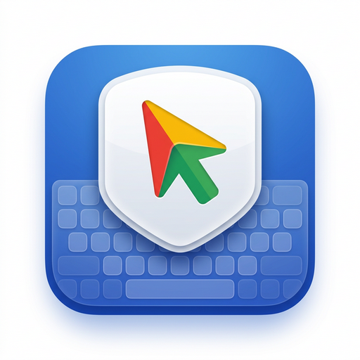

<div align="center">
  
  <h1>Windpad 🖱️⌨️</h1>
  <p><strong>Turn your Android phone into a Bluetooth HID Trackpad & Keyboard for any device.</strong></p>

  [](https://flutter.dev/)
  [](https://www.android.com/)
  [](https://www.python.org/)
</div>

<br/>

Windpad connects via Bluetooth HID — **no apps needed on the receiving end**. It works seamlessly out of the box with Windows, macOS, Linux, Smart TVs, Android TV, and more. 

For the ultimate experience on Windows, the included **Windpad Helper** adds advanced cursor acceleration, low-pass filtering, and special quick-keys for power users.

---

## 📸 Screenshots

*(💡 **Tip**: To add your real screenshots here, open this `README.md` file on GitHub, click the Edit (✏️) icon, and just drag-and-drop your images right below this text!)*

<div align="center">
  
  &nbsp;&nbsp;&nbsp;&nbsp;
  
  &nbsp;&nbsp;&nbsp;&nbsp;
  
</div>

---

## ✨ Features

* 🖱️ **Trackpad** — Smooth cursor movement with low-pass filtering & pointer acceleration
* ✌️ **Multi-gesture** — 1-finger move, 2-finger scroll, pinch-to-zoom, 3-finger swipe
* ⌨️ **Keyboard** — Type directly; sends HID keycodes character by character
* ⚡ **Quick Keys** — Copy, Paste, Cut, Undo, Select All, Enter, Emoji
* 🛠️ **Special Keys** — F1–F12, Nav (Home/End/PgUp/PgDn/arrows), Media, sticky modifiers
* 📋 **Clipboard Paste** — Sends clipboard text char-by-char preserving formatting
* 🔗 **Auto-connect** — Remembers the last device, auto-reconnects on launch
* 🎨 **Theming** — Dark / Light / System theme (Material 3 app-wide theming)
* 🔒 **Trackpad Lock** — Locks trackpad while the system keyboard is open
* ⚙️ **Settings** — DPI, trackpad color, spreadsheet mode, emoji OS toggle (Win/Mac)

---

## 📥 Download & Installation

1. Check the `windpad-server/dist/` folder in this repository.
2. Download **`WindPad.apk`** and install it on your Android phone.
3. *(Optional for Windows users)* Use the Python files in `windpad-server` to run or build the companion application to enable advanced cursor smoothing and extra utilities.

---

## 🚀 Getting Started (Developers)

### Prerequisites
- **Flutter SDK** ≥ 3.0.0
- **Android SDK** (minSdk 28)
- A Bluetooth-capable Android phone

### Build & Run
Clone the repository and install dependencies:
```bash
git clone https://github.com/Aditya-err/WindPad-Os-Controller.git
cd WindPad-Os-Controller
flutter pub get
```

To build the APK:
```bash
flutter build apk --release --split-per-abi --shrink
```
*Compiled APKs will be located in `build/app/outputs/flutter-apk/`.*

---

## 📦 Tech Stack

- **Flutter** + **Dart** — Beautiful and fast cross-platform UI.
- **Kotlin** — Native Bluetooth HID via Android `BluetoothHidDevice` API.
- **Python** — Server companion app (`windpad-server`) utilizing PyInstaller.
- **Provider** — State management.
- **SharedPreferences** — Settings persistence.

---

## 📄 Credits

Developed by **Aditya** 🎓 — Made in India 🇮🇳
