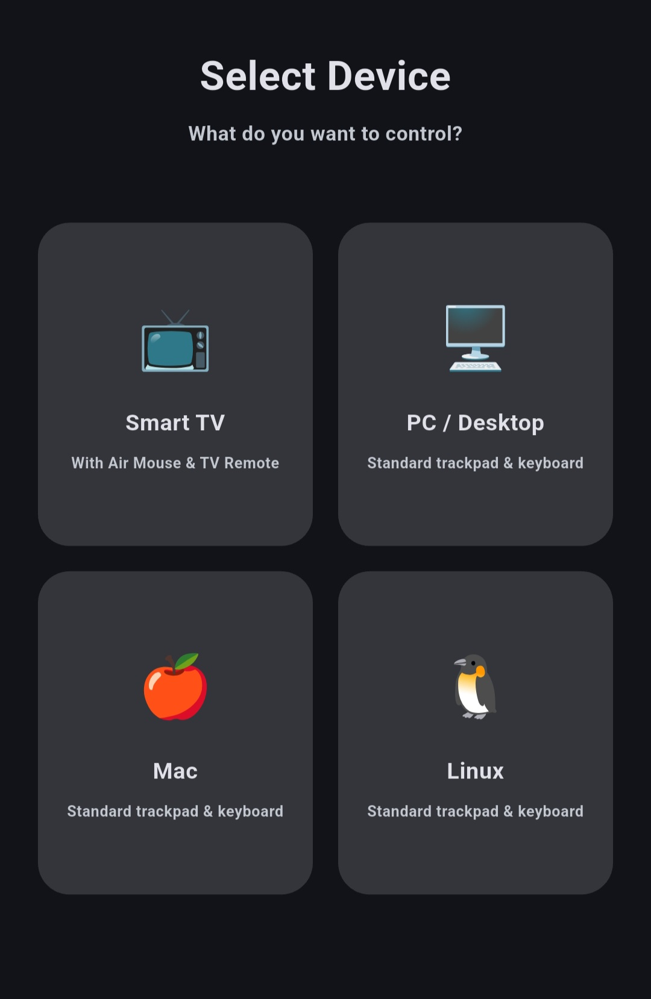
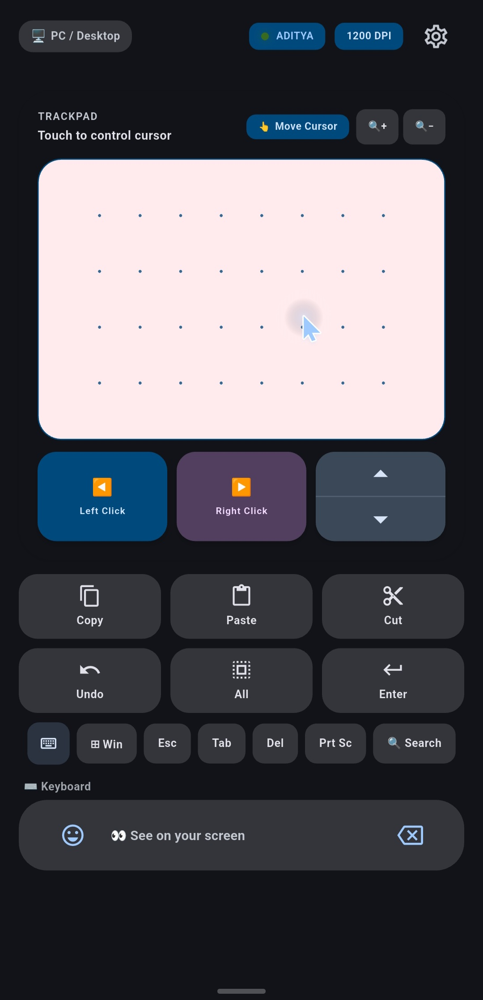
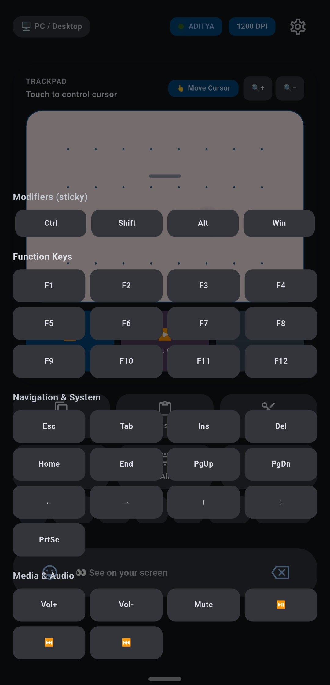
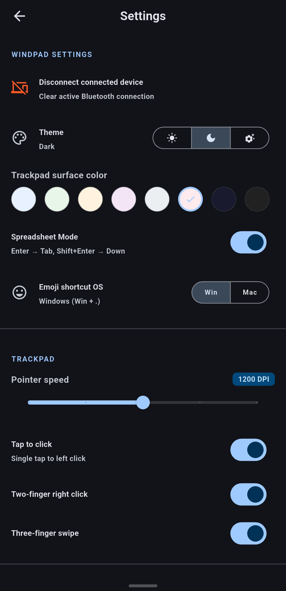
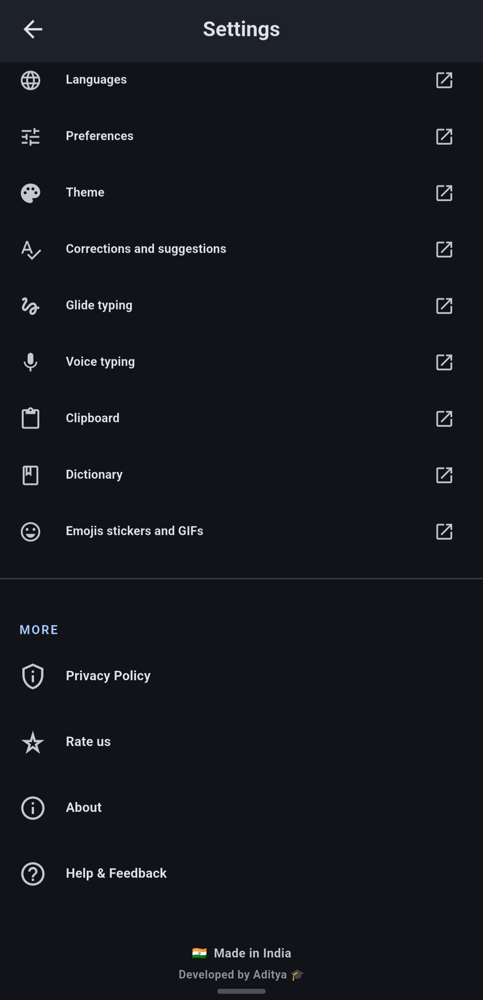

<div align="center">
  
  
  # WindPad
  
  **Turn your Android phone into a Bluetooth HID mouse, trackpad and keyboard.**
  
  <p>Works with Windows, macOS, Linux & compatible Smart TVs — no receiver app required.</p>

  [](https://Aditya-err.github.io/WindPad-Os-Controller/)
  [](https://github.com/Aditya-err/WindPad-Os-Controller/releases)
  [](#license)
</div>

<br/>

## 📖 Overview

WindPad transforms your Android device into a low-latency, fully functional Bluetooth HID trackpad and keyboard. Because it uses standard Bluetooth Human Interface Device (HID) protocols, the target computer or device recognizes it as a physical mouse and keyboard. **No receiver application is normally required.**

## ✨ Features

- 🖱️ **Bluetooth HID Mouse & Trackpad** — Precision control tailored for speed and accuracy.
- ⌨️ **Keyboard Input** — Type directly; sends HID keycodes character by character.
- ✌️ **Multi-touch Gestures** — 1-finger move, 2-finger scroll, pinch-to-zoom, 3-finger swipe.
- ⚡ **Quick Action Keys** — Dedicated buttons for Copy, Paste, Cut, Undo, Select All, and Emoji.
- 📋 **Smart Clipboard Paste** — Sends text directly from your phone's clipboard to your PC.
- 🎨 **Material Theming** — Beautiful Dark, Light, and System themes.
- ⚙️ **Optional Windows Helper** — An optional server app for advanced pointer smoothing.

## 🤔 Why WindPad?

**WindPad (Bluetooth HID)**
- Acts like a standard hardware mouse/keyboard.
- **No receiver app required** on the target device.
- Does not depend on Wi-Fi networks or router configurations.
- Open Source, Free, No Ads, and No Tracking.

**Typical Wi-Fi Remote Apps**
- Often require a companion receiver app installed on every PC.
- Depend heavily on stable Wi-Fi network configuration.
- May not behave like native HID devices in all contexts.

## 💻 Compatibility

| Platform | Support |
| :--- | :---: |
| **Windows** | ✅ |
| **macOS** | ✅ |
| **Linux** | ✅ |
| **Compatible Smart TVs** | ✅ |
| **Android** | Controller (Host) |

## 📸 Screenshots

<div align="center">
  
  &nbsp;
  
  &nbsp;
  
  &nbsp;
  
  &nbsp;
  
</div>

<!-- Placeholder for future Demo GIF / Video -->
<!-- <div align="center"></div> -->

## 📥 Installation

1. Go to the [GitHub Releases](https://github.com/Aditya-err/WindPad-Os-Controller/releases) page. (Or check the `website/assets/` folder in this repository).
2. Download the **`WindPad.apk`** and install it on your Android phone.
3. Enable Bluetooth on your computer or Smart TV.
4. Pair your Android phone with the target device via the system Bluetooth settings.
5. Open WindPad, connect, and start controlling!

## ⚙️ How It Works

```text
[ Android Phone ]  -->  ( Bluetooth HID Protocol )  -->  [ Computer / Smart TV ]
                                                                 ↓
                                                    ( Recognized as Standard Mouse + Keyboard )
```
By leveraging the native `BluetoothHidDevice` API in Android, WindPad communicates exactly like a standard physical mouse or keyboard would, bypassing the need for any proprietary receiver software.

## 🛠️ Windows Helper (Optional)

For users wanting the ultimate experience on Windows, the included **Windpad Helper** (`windpad-server`) is an *optional*, Windows-only companion application.
- Provides advanced cursor acceleration and low-pass filtering.
- Enables special quick-keys for power users.
- *Note: WindPad itself does not require this helper for basic HID functionality.*

## 🔒 Privacy

WindPad respects your privacy by design:
- **No Ads**
- **No Tracking or Analytics**
- **100% Open Source**
- No internet access is required to use the core Bluetooth features.

## 🛡️ Permissions

WindPad requires certain Android permissions to function correctly. Here is exactly what we ask for and why:

- **Bluetooth & Bluetooth Admin (Legacy) / Bluetooth Scan, Connect, Advertise (Android 12+)**: Required to discover, pair, and communicate with your PC or Smart TV via Bluetooth HID.
- **Location (Max SDK 30)**: Required by Android exclusively for legacy Bluetooth scanning. We do not track your location.
- **Foreground Service & Wake Lock**: Required to keep the Bluetooth connection alive in the background so the app doesn't disconnect when you switch tasks.

## 🗺️ Roadmap

- [x] Bluetooth HID Core (Mouse & Keyboard)
- [x] Multi-touch gestures
- [x] Smart clipboard paste
- [ ] Custom gesture mapping
- [ ] More media controls
- [ ] Additional keyboard layouts
- [ ] Improved platform compatibility testing

## 🤝 Contributing

We welcome contributions from the open-source community!
1. Fork the repository.
2. Create a feature branch (`git checkout -b feature/AmazingFeature`).
3. Commit your changes (`git commit -m 'Add some AmazingFeature'`).
4. Push to the branch (`git push origin feature/AmazingFeature`).
5. Open a Pull Request.

Please look out for issues labeled `good first issue`, `help wanted`, `bug`, or `enhancement` if you want to contribute!

## ❓ FAQ

**Does the computer need a receiver app?**
No, WindPad uses standard Bluetooth HID profiles. Your PC thinks it's a real, physical bluetooth mouse.

**Does WindPad require Wi-Fi or Internet?**
No, it operates entirely over Bluetooth. No Wi-Fi or internet connection is required.

**Which operating systems are supported?**
It works seamlessly with Windows, macOS, Linux, and compatible Smart TVs.

**Is it free and open source?**
Yes, 100% free, open-source, with no ads or tracking.

**What is the Windows Helper? Is it required?**
It is completely optional. It provides advanced pointer smoothing for Windows machines. You do not need it to use WindPad.

**What should I do if pairing fails?**
Unpair the device from both your phone and PC, restart Bluetooth on both devices, and try pairing again from your PC's Bluetooth settings menu.

## 📄 License

This project is open-source. Please see the [LICENSE](LICENSE) file for more information. *(Update this link to your specific license once added).*
